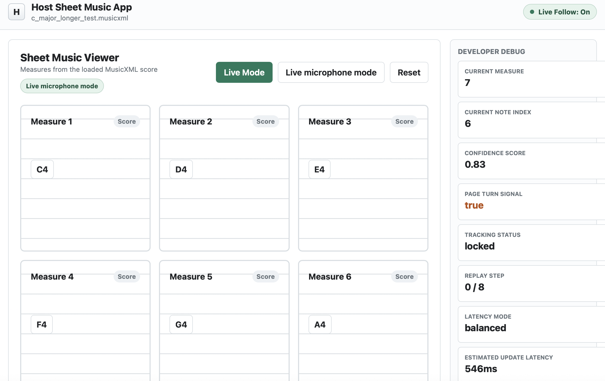

# Strobato

Website: https://strobato.netlify.app



Strobato is an SDK for synchronizing musical performance with digital sheet
music.

It is designed for existing sheet music platforms, not as a standalone sheet
music app. A host reader could use Strobato to understand where a musician is
in a MusicXML score, highlight the current measure, and decide when to turn a
page.

The project is intentionally SDK-first and small. The stable path today is:

- load a MusicXML score
- send simulated note windows such as `["C4", "D4", "E4"]`
- infer the current measure and note index
- return confidence and tracking status
- signal when a page turn should happen

Live microphone input exists as an experimental optional prototype. The core
SDK API is still built around note windows, so simulated notes and future audio
input use the same score-following engine.

## Vision

Strobato is intentionally narrow in its first MVP, but the long-term goal is broader real-time music intelligence infrastructure for digital performance and practice tools.

The current SDK focuses on:
- MusicXML score following
- measure tracking
- confidence estimation
- page-turn signaling

Future directions could include:
- expressive performance tracking
- ensemble synchronization
- rehearsal and practice analytics
- adaptive accompaniment systems
- polyphonic and chord-aware tracking
- real-time collaborative music experiences
- deeper integrations with digital sheet music ecosystems

The current repository is focused on proving the core score-following loop before expanding into more advanced musical interaction systems.

## Quick Start

From the repository root:

```bash
python3 -m venv .venv
.venv/bin/python -m pip install -e .
.venv/bin/python -m pip install pytest
```

Run the developer-facing host app example:

```bash
PYTHONPATH=src .venv/bin/python examples/sdk_host_app_example.py
```

Run the test suite:

```bash
.venv/bin/python -m pytest -q
```

## Installation And Setup

For local SDK development:

```bash
python3 -m venv .venv
.venv/bin/python -m pip install -e .
.venv/bin/python -m pip install pytest
```

The base SDK has no required third-party runtime dependencies.

For experimental microphone demos, install the optional audio dependencies:

```bash
.venv/bin/python -m pip install sounddevice numpy
```

## How The SDK Works

The host sheet music app loads a MusicXML score into `StrobatoEngine`.

As the musician plays, the host app sends Strobato a short recent window of
note names. Strobato compares that note window to the score reference map and
returns:

- `current_measure`: the measure the musician is probably playing
- `current_note_index`: the note position in the flattened score timeline
- `confidence_score`: how confident Strobato is
- `page_turn_signal`: whether the host app should turn the page now
- `tracking_status`: whether the SDK is searching, locked, uncertain, or lost

## Example SDK Usage

```python
from strobato_sdk import StrobatoEngine

engine = StrobatoEngine(measures_per_page=2)
engine.load_score("examples/c_major_longer_test.musicxml")

result = engine.update_with_notes(["C4", "D4", "E4"])

print(result.current_measure)
print(result.current_note_index)
print(result.confidence_score)
print(result.page_turn_signal)
print(result.tracking_status)

print(engine.get_current_measure())
print(engine.get_confidence())
print(engine.should_turn_page())
print(engine.get_tracking_status())
```

## Host App Integration Example

The file `examples/sdk_host_app_example.py` shows how a third-party sheet music
platform could use Strobato inside its own score reader. The host app loads a
MusicXML score, sends simulated note windows into `StrobatoEngine`, reads the
SDK result, and then decides whether to highlight a measure or turn a page.

Run it with:

```bash
PYTHONPATH=src .venv/bin/python examples/sdk_host_app_example.py
```

This example is intentionally plain and developer-facing. It demonstrates the
SDK integration pattern, not a standalone Strobato app.

## Visual Host App Demo

Run the local browser demo in replay mode:

```bash
PYTHONPATH=src .venv/bin/python examples/visual_demo.py --score examples/c_major_longer_test.musicxml
```

Then open:

```text
http://127.0.0.1:8765
```

Replay mode starts automatically after the page loads. The current measure
highlight, confidence, tracking status, page-turn signal, replay status, and
compressed note window update as the simulated performance advances.

The visual demo is framed as a generic host sheet-music reader. The score is
the main surface, and the AI tracking status panel shows the SDK output:
`current_measure`, `current_note_index`, `confidence_score`,
`page_turn_signal`, `tracking_status`, `latency_mode`, and
`expected_next_note`.

Experimental live microphone visual mode is also available:

```bash
PYTHONPATH=src .venv/bin/python examples/visual_demo.py --score examples/c_major_longer_test.musicxml --live --latency-mode balanced --port 8779
```

Latency modes:

- `stable`: safest and least likely to accept false notes
- `balanced`: recommended for controlled demos; faster with an anti-skip guard
- `fast`: most responsive, but can jump early in noisy rooms

## Other Examples

See [examples/README.md](examples/README.md) for the full example list.

Common commands:

```bash
PYTHONPATH=src .venv/bin/python examples/simulated_following.py
PYTHONPATH=src .venv/bin/python examples/integration_demo.py
PYTHONPATH=src .venv/bin/python examples/pitch_detection_demo.py
PYTHONPATH=src .venv/bin/python examples/live_score_following_demo.py --demo
```

For real piano testing, see
[REAL_PIANO_TESTING_GUIDE.md](REAL_PIANO_TESTING_GUIDE.md).

For investor/demo recording, see
[DEMO_RECORDING_GUIDE.md](DEMO_RECORDING_GUIDE.md).

## Repository Structure

```text
strobato/
  src/strobato_sdk/        Core SDK modules
  examples/                Local demos, sample MusicXML scores, and host-app examples
  tests/                   Pytest coverage for parsing, matching, tracking, audio helpers, and demos
  runs/                    Local generated logs; ignored except for .gitkeep
  AGENTS.md                Project instructions for coding agents
  README.md                Main developer guide
  *_GUIDE.md               Human testing and recording guides
  PROTOTYPE_MILESTONE_*.md Milestone summaries from live piano demos
```

Core SDK modules:

- `engine.py`: public `StrobatoEngine` API
- `musicxml.py`: small MusicXML parser
- `score_map.py`: flattened score reference map
- `matcher.py`: note-window matching logic
- `tracker.py`: stateful score follower
- `audio.py`: simulated and placeholder input interfaces
- `pitch.py`: frequency-to-note helpers
- `microphone.py`: experimental live microphone prototype

## Current Limitations

- MusicXML support is intentionally small and focused on simple note sequences.
- The matcher works with recent note windows, not full expressive performance
  modeling.
- Live microphone mode is experimental and monophonic.
- Piano chords and polyphonic transcription are not supported yet.
- Room noise, overtones, and microphone quality can still affect pitch
  detection.
- The browser demo is a local integration demo, not a production web app.

## Roadmap

Near-term milestones:

- test one simple non-scale melody with live piano input
- reduce visual demo polling lag without making early jumps more likely
- improve page-turn animation for demo recordings
- improve noisy-note rejection in microphone mode
- keep MusicXML parsing simple but cover more common score shapes

Later milestones:

- evaluate stronger pitch detection options
- explore chord and polyphonic detection
- expose clearer host-app integration hooks if real partners need them
- prepare a small SDK package release once the API settles

## Experimental Microphone Notes

Live audio has two separate layers:

- Pitch detection listens to microphone audio and estimates note names like
  `E4`, `D#4`, or `B3`.
- Score following takes those note names and decides where the musician is in
  the MusicXML score.

Piano pitch detection is difficult because a piano note contains harmonics and
overtones, and sometimes those upper partials are louder than the fundamental
note. The current prototype uses autocorrelation, confidence filtering, note
debouncing, octave stabilization, and note-event compression to make the
detected note stream steadier.

Run calibration before serious live testing:

```bash
PYTHONPATH=src .venv/bin/python examples/pitch_calibration_demo.py
```

Run the live score-following demo in simulated demo mode:

```bash
PYTHONPATH=src .venv/bin/python examples/live_score_following_demo.py --demo
```

Run it with a real microphone and the current C major test score:

```bash
PYTHONPATH=src .venv/bin/python examples/live_score_following_demo.py --score examples/c_major_longer_test.musicxml
```

The real piano validation sequence is:

```text
C4, D4, E4, F4, G4, A4, B4, C5
```

## Project Direction

Strobato should stay SDK-first:

- no standalone app yet
- MusicXML first
- simulated note matching remains the stable default
- live audio remains optional and experimental
- beginner-friendly code
- prove the core score-following loop before expanding scope
